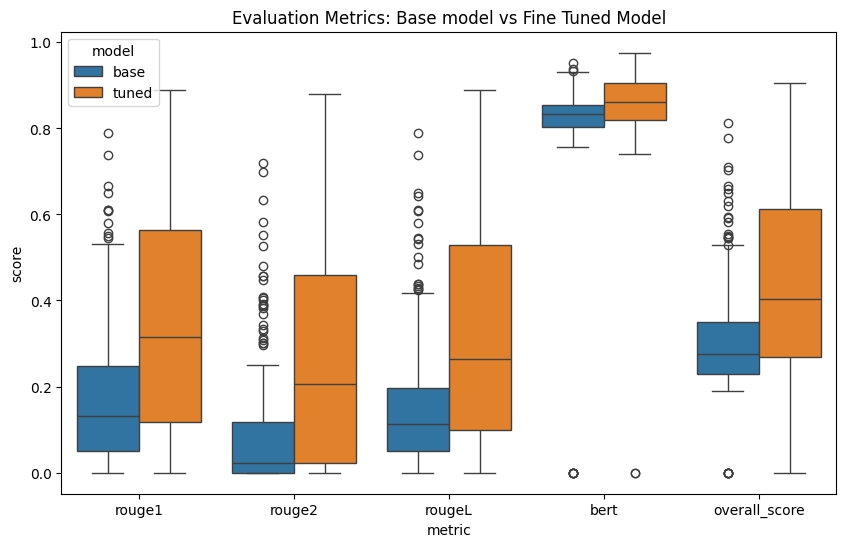

# Cyber Threat Report Summarization Using FLAN-T5 with LoRA Adaptation

## Overview
This project aims to enhance cyber threat report summarization using FLAN-T5 with Low-Rank Adaptation (LoRA). FLAN-T5 is a powerful pre-trained transformer model, and LoRA enables efficient fine-tuning by reducing the number of trainable parameters while maintaining performance.

> Cyber Summarization and Why FLAN-T5? 
Summarizing cyber threat reports is essential for quick decision-making and threat mitigation. Traditional models struggle with domain-specific terminology and structured data. FLAN-T5, designed for instruction-tuned tasks, excels at understanding and generating high-quality summaries while requiring minimal task-specific training.

> Why LoRA?
Fine-tuning large models is computationally expensive. LoRA addresses this by introducing low-rank matrices to adapt pre-trained weights, significantly reducing the number of trainable parameters. This enables efficient training on limited hardware without sacrificing performance.

## Dataset

The dataset [`cyberSummarization`](https://huggingface.co/datasets/JamesLin0219/cyberSummarization) consists of structured cyber threat reports. The data is split as follows:
- **Training Set**: 70% (28576 samples)
- **Validation Set**: 15% (6124 samples)
- **Test Set**: 15% (6124 samples)

## LoRA Configuration and Model Setup

We use the `google/flan-t5-base model` for fine-tuning. The model is loaded with the `AutoModelForSeq2SeqLM` class, and a LoRA configuration is set up to adapt the model for better summarization performance.

```python
# LoRA configuration for model fine-tuning
lora_config = LoraConfig(
    r = 64,  # rank of LoRA adapters
    lora_alpha=128,  # scaling factor for LoRA
    target_modules=["q", "k", "v", "o"],  # layers to apply LoRA
    lora_dropout=0.10,  # regularization factor
    bias="none",
    task_type=TaskType.SEQ_2_SEQ_LM  # Task type: sequence-to-sequence language modeling
)
```

Then we load base model and create PEFT model:

```python
base_model_name = 'google/flan-t5-base'
tokenizer = AutoTokenizer.from_pretrained(base_model_name)

# Load base model
base_model = AutoModelForSeq2SeqLM.from_pretrained(base_model_name, torch_dtype=torch.bfloat16, device_map='auto')

# Create PEFT model
peft_model = get_peft_model(base_model, lora_config)
peft_model.print_trainable_parameters()
```


## Prompt Engineering and Tokenization

A prompt is constructed by prefixing each document with a summarization instruction. The documents and human-generated summaries are then tokenized. T5 models require the [`summarize`](https://thecleverprogrammer.com/2024/10/07/text-summarization-model-using-llms/#:~:text=The%20%E2%80%9Csummarize%3A%E2%80%9D%20prefix%20for,summary%20of%20the%20input%20text.) keyword generate text summaries:

```python
PREFIX = 'Summarize: '
MAX_INPUT_LENGTH = 1024
MAX_TARGET_LENGTH = 64

def preprocess_for_summarization(examples):
    """Prepare the dataset for instruction fine-tuning."""
    docs = [PREFIX + doc for doc in examples['document']]
    model_inputs = tokenizer(docs, max_length=MAX_INPUT_LENGTH, truncation=True)
    
    # Tokenize human-generated summaries
    label_ids = tokenizer(text_target=examples['summary'], max_length=MAX_TARGET_LENGTH,
                          padding='max_length', truncation=True)
    model_inputs['labels'] = label_ids['input_ids']
    return model_inputs
```

Then we use Flan-T5’s tokenizer to preprocess text data before training:

```python
from transformers import AutoTokenizer

base_model_name = 'google/flan-t5-base'
tokenizer = AutoTokenizer.from_pretrained(base_model_name)

tokenized_datasets = final_dataset.map(preprocess_for_summarization, batched=True)
tokenized_datasets = tokenized_datasets.remove_columns(['document', 'summary', 'id'])
```

## Training

Training is done with the following configuration. Here, `data_collator` function dynamically sets the padding during training ensures prompts of are equal length.

```python
data_collator = DataCollatorForSeq2Seq(tokenizer=tokenizer, model=base_model)

# Training Config
config_training = TrainingArguments(
    output_dir=DIR_TRAIN,
    auto_find_batch_size=True,
    learning_rate=1e-4,
    logging_steps=1,
    max_steps=100
)

# Trainer
trainer = Trainer(
    model=peft_model,
    args=config_training,
    data_collator = data_collator,
    train_dataset=tokenized_datasets['train'],
    eval_dataset=tokenized_datasets['validation']
)
```


## Understanding the Evaluation Metrics

The function `get_model_evaluations` computes two key NLP evaluation metrics:  

1. **ROUGE Score (Recall-Oriented Understudy for Gisting Evaluation)**  
   - Measures `n-gram overlap` between generated summaries and human-written summaries.  
   - Higher values mean better summarization performance.
   - Metrics used:  
     - `rouge1`: Unigram overlap (single words)  
     - `rouge2`: Bigram overlap (two consecutive words)  
     - `rougeL`: Longest Common Subsequence  

2. **BERTScore**  
   - Uses a pretrained BERT model to compute semantic similarity between generated and human summaries.  
   - Measures how well the model captures meaning beyond just word matching.  
   - Higher F1 scores indicate better alignment with human-written summaries.  

3. **Overall Score**  
   - The script averages ROUGE and BERT scores for each summary, creating a final `overall_score` metric for comparison.  


## Performance Comparison Results



*Figure 1: Comparison of evaluation metrics between the base model and the fine-tuned model.*

- **Median scores**  
  - The base model had a median overall score of 0.28.  
  - The fine-tuned model had a higher median overall score of 0.40.  
  - This means that, on average, the fine-tuned model performs better than the base model.  

- **Proportion of Best Model per Example**  
  - Base model performed better for 29% of cases.  
  - Tuned model performed better for 71% of cases.
  - This means that for 71% of test samples, the fine-tuned model produced summaries that were closer to human-written ones based on ROUGE and BERTScore.  


